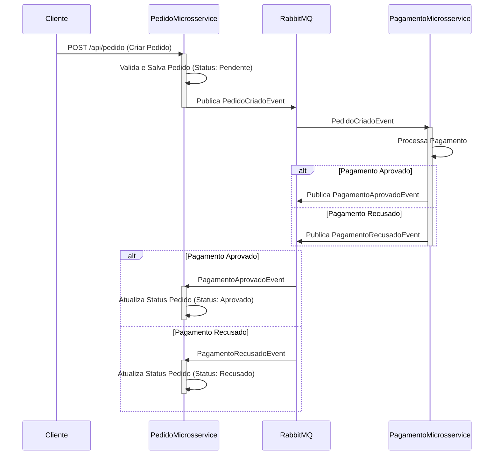

### Resumo do Projeto: APIPedidoMicrosservico

Este projeto `APIPedidoMicrosservico` é uma solução de estudo baseada em microsserviços que gerencia o fluxo de pedidos e pagamentos. Ele é composto por dois microsserviços principais: `PedidoMicrosservice` e `PagamentoMicrosservice`, que se comunicam de forma assíncrona utilizando um Event Bus (MassTransit com RabbitMQ). A arquitetura visa alta escalabilidade, resiliência e desacoplamento, seguindo princípios de Domain-Driven Design (DDD) com camadas de Domínio, Aplicação e Infraestrutura.

#### Microsserviço de Pedido (`PedidoMicrosservice`)

O `PedidoMicrosservice` é responsável pela criação e gestão do ciclo de vida dos pedidos.
*   **Funcionalidades Principais:**
    *   **Criação de Pedidos:** Recebe solicitações para criar novos pedidos, validando os dados e persistindo-os.
    *   **Atualização de Status:** Atualiza o status de pedidos com base em eventos de pagamento (aprovado ou recusado) recebidos do `PagamentoMicrosservice`.
*   **Comunicação Assíncrona:**
    *   **Publica:** O evento `PedidoCriadoEvent` é publicado após a criação bem-sucedida de um pedido, notificando outros microsserviços (como o de Pagamento) sobre a necessidade de processar o pagamento.
    *   **Consome:** Ouve os eventos `PagamentoAprovadoEvent` e `PagamentoRecusadoEvent` para atualizar o status interno do pedido.

#### Microsserviço de Pagamento (`PagamentoMicrosservice`)

O `PagamentoMicrosservice` é dedicado ao processamento de pagamentos para os pedidos criados.
*   **Funcionalidades Principais:**
    *   **Processamento de Pagamento:** Recebe eventos de novos pedidos e inicia o processo de pagamento.
    *   **Registro de Tentativas:** Registra as tentativas de pagamento.
*   **Comunicação Assíncrona:**
    *   **Consome:** Ouve o evento `PedidoCriadoEvent` para processar o pagamento do pedido recém-criado.
    *   **Publica:** Publica os eventos `PagamentoAprovadoEvent` ou `PagamentoRecusadoEvent` após a conclusão do processamento do pagamento, informando o `PedidoMicrosservice` sobre o resultado.

#### Tecnologias e Arquitetura

*   **.NET Core:** Framework principal para o desenvolvimento dos microsserviços.
*   **MassTransit & RabbitMQ:** Utilizados como Event Bus para comunicação assíncrona e desacoplada entre os microsserviços. Isso garante resiliência e a capacidade de processar mensagens de forma independente.
*   **Serilog:** Implementado para logging estruturado e centralizado, facilitando a observação e depuração da aplicação.
*   **Swagger/OpenAPI:** Para documentação interativa e teste das APIs.
*   **Arquitetura em Camadas:** Cada microsserviço é estruturado em camadas (Domínio, Aplicação, Infraestrutura, API) para garantir a separação de responsabilidades e facilitar a manutenção e evolução.

---

### Fluxograma de Funcionamento

